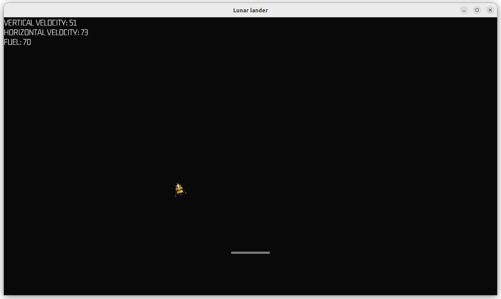

## Lunar lander
Rust implementation of Lunar Lander game using Bevy (0.8) and Rapier 2D.

### Description
Use left & right arrow to rotate Artemis Lunar Lander and up arrow to fire engine. Goal is to land on moon surface (currently there is only landing pad - land generation will be in patch 1.1)

### Credits
Lander sprite by Tomasz Antczak

